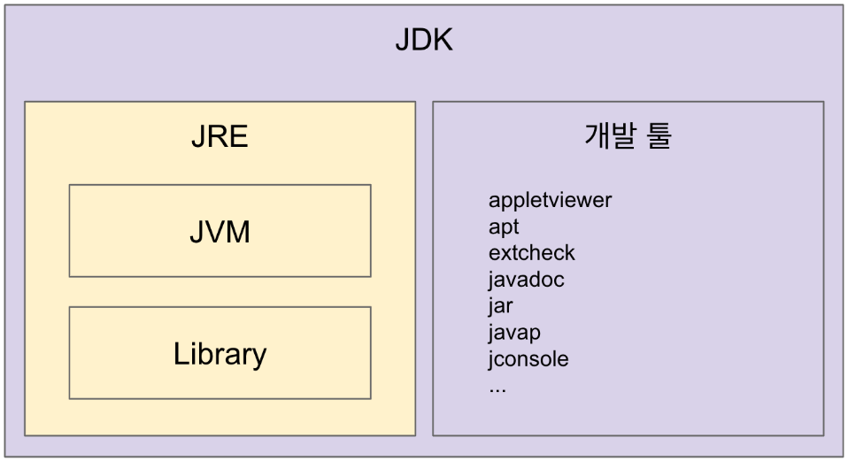
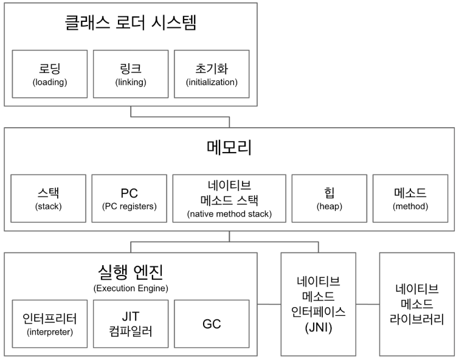
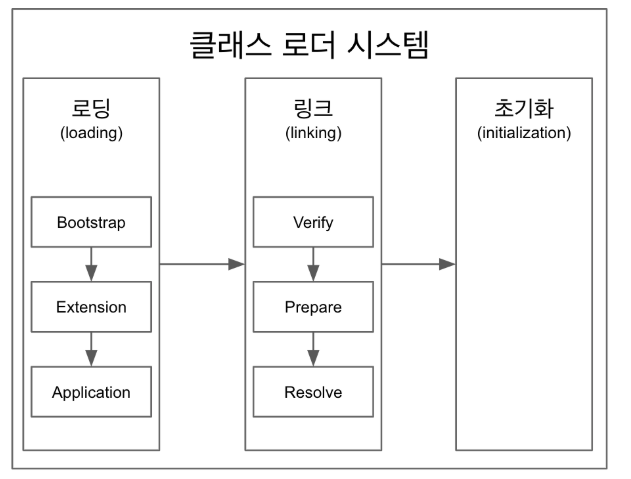

## JAVA, JVM, JDK, JRE

### JVM(Java Virtual Machine)
- 자바 가상 머신으로 **자바 바이트 코드(.class 파일)** 를 OS에 특화된 코드로 변환(인터프리터와 JIT 컴파일러)하여 실행한다.
- 바이트 코드를 실행하는 표준(JVM 자체는 표준)이자 구현체(**특정 밴더** 가 구현한 JVM)다.
- JVM 스팩: https://docs.oracle.com/javase/specs/jvms/se11/html/
- JVM 밴더: 오라클, 아마존, Azul 등
- 특정 플랫폼에 종속적 -> native code로 바꿔서 실행해야하는데 그것은 os에 맞춰서 실행해야함
```java
public class HelloJava{
  public static void main(String arg[]){
    System.out.println("HelloJava");
  }
}
javac HelloJava.java
javap -c HelloJava 여기가 바이트 코드
```

### JRE (Java Runtime Environment): JVM + 라이브러리
- 자바 애플리케이션을 **실행할 수 있도록 구성된 배포판.**
- JVM과 핵심 라이브러리 및 자바 런타임 환경에서 사용하는 프로퍼티 세팅이나 리소스 파일을 가지고 있다.
- **개발 관련 도구는 포함하지 않는다. (그건 JDK에서 제공)**

### JDK (Java Development Kit): JRE + 개발 툴
- JRE + 개발에 필요할 툴
- 소스 코드를 작성할 때 사용하는 자바 언어는 플랫폼에 독립적.
- **오라클은 자바 11부터는 JDK만 제공하며 JRE를 따로 제공하지 않는다.**
- Write Once Run Anywhere

### 자바
- 프로그래밍 언어
- JDK에 들어있는 자바 컴파일러(javac)를 사용하여 바이트코드(.class 파일)로 컴파일 할 수 있다.
- 자바 유료화? 오라클에서 만든 **Oracle JDK 11 버전부터 상용으로 사용할 때 유료.** [참고](https://medium.com/@javachampions/java-is-still-free-c02aef8c9e04)

### JVM 언어
- JVM 기반으로 동작하는 프로그래밍 언어
- 어떠한 프로그래밍 언어로 코딩을 하더라도 컴파일시 class 파일이나 java파일로 만들어지면 JVM을 활용할 수 있다.
- 클로저, 그루비, JRuby, Jython, Kotlin, Scala, ...

### 참고
- [JIT 컴파일러](https://aboullaite.me/understanding-jit-compiler-just-in-time-compiler/)
- [JDK, JRE 그리고 JVM](https://howtodoinjava.com/java/basics/jdk-jre-jvm/)
- https://en.wikipedia.org/wiki/List_of_JVM_languages
---
##JVM 구조
- IDE로 .class를 보면 일반 자바코드로 보인다. 하지만 사실 바이트코드를 디컴파일 해준것이다.

### 클래스 로더 시스템
- .class 에서 바이트코드를 읽고 메모리에 저장
- 로딩: 클래스 읽어오는 과정
- 링크: 레퍼런스를 연결하는 과정
- 초기화: static 값들 초기화 및 변수에 할당

### 메모리
- ***메서드 영역에는*** 클래스 수준의 정보 (클래스 이름, 부모 클래스 이름, 메소드, 변수) 저장. **공유 자원이다.**
- ***힙 영역에는*** 객체를 저장.  **공유 자원이다.**
- 힙, 메서드만 모든 영역에 공유하는 자원이고, **나머지 블럭들은 쓰레드에서만** 공유하는 자원이다.
- ***스택 영역에는*** 쓰레드 마다 런타임 스택을 만들고, 그 안에 메소드 호출을 스택 프레임이라 부르는 블럭으로 쌓는다. 쓰레드 종료하면 런타임 스택도 사라진다.
  - 에러메시지를 볼때 로그에 메시지가 쌓여있는것을 볼 수 있는데
- ***PC(Program Counter) 레지스터:*** 쓰레드 마다 쓰레드 내 현재 실행할 스택 프레임을 가리키는 포인터가 생성된다.
- [네이티브 메서드 스택](https://javapapers.com/core-java/java-jvm-run-time-data-areas/#Program_Counter_PC_Register): 쓰레드마다 생기며 네이티브 메소드를 호출할 때 사용하는 메서드 스택
  - 메서드에서 네이티브란 키워드가 붙어있고 그 구현을 자바가 아닌 C나 C++로 한것이 네이티브 메소드 스택이라고 한다.
  - Thread.currentThread() -> 이메서드를 보면 네이티브 메서드인것을 알 수 있다.
  - 직접 만들어 사용할 일을 없을 것이며 JNI랑 네이티브 메서드 라이브러리에 대해 알고는 있자
  - 네이티브 메서드를 사용하는 코드가 있으면 네이티브 메서드 스택이 생기고 그 안에 네이티브 인터페이스를 호출하는 스택 프레임이 쌓일것이다.
### 실행 엔진
- **인터프리터:** 바이트 코드를 한줄 씩 실행.
- **JIT 컴파일러:** 인터프리터 효율을 높이기 위해, 인터프리터가 반복되는 코드를 발견하면 JIT 컴파일러로 반복되는 코드를 모두 네이티브 코드로 바꿔둔다. 그 다음부터 인터프리터는 네이티브 코드로 컴파일된 코드를 바로 사용한다.
- **GC(Garbage Collector):** 더이상 참조되지 않는 객체를 모아서 정리한다.
  - GC는 이해는 물론, 직접 커스텀할 수도 있다. 잘 알고 있어야 한다.
  - 서버운영시 많은 객체가 있고 응답시간이 중요하면 스탑더 월드, GC를 할 때 발동하는 멈춤현상을 최소화하는 GC를 사용하는게 좋을 것이다.
  - 자바 성능 책에 자세히 나와있다.

### JNI(Java Native Interface)
- 자바 애플리케이션에서 C, C++, 어셈블리로 작성된 함수를 사용할 수 있는 방법 제공
- Native 키워드를 사용한 메소드 호출
- https://medium.com/@bschlining/a-simple-java-native-interface-jni-example-in-java-and-scala-68fdafe76f5f  
### 네이티브 메소드 라이브러리
- C, C++로 작성 된 라이브러리

### 정리
 - 클래스 로더가 읽어서 메모리에 적절히 배치하고 실행할 때 쓰레드가 만들어지면 실행엔진이 바이트코드를 한줄씩 실행한다. 실행을 하면서 스택을 사용하는데 한줄한줄씩 실행 시 비효율 적이니 JIT 컴파일러를 쓰고 GC를 이용하여 메모리를 관리한다. 코어쪽으로 들어가면 많은 부분이 네이티브이다. 네이티브를 쓸땐 JNI를 통해서 쓰게되어있는 구조이다.
---


## 클래스 로더
- 로딩, 링크, 초기화 순으로 진행된다.
- 로딩
  - 클래스 로더가 .class 파일을 읽고 그 내용에 따라 적절한 바이너리 데이터를 만들고 “메소드” 영역에 저장.
  - 이때 메소드 영역에 저장하는 데이터
    - FQCN
    - 클래스 | 인터페이스 | 이늄
    - 메소드와 변수
  - **로딩이 끝나면** 해당 클래스 타입의 **Class 객체를 생성하여 “힙" 영역에 저장.**
  - 링크
    - Verify, Prepare, Reolve(optional) 세 단계로 나눠져 있다.
    - 검증: .class 파일 형식이 유효한지 체크한다.
    - Preparation: 클래스 변수(static 변수)와 기본값에 필요한 메모리
    - Resolve: 심볼릭 메모리 레퍼런스를 메소드 영역에 있는 실제 레퍼런스로 교체한다.(optional)
  - 초기화
    - Static 변수의 값을 할당한다. (static 블럭이 있다면 이때 실행된다.)
  - 클래스 로더는 계층 구조로 이뤄져 있으면 기본적으로 세가지 클래스 로더가 제공된다.
    - 부트 스트랩 클래스 로더 -  JAVA_HOME\lib에 있는 코어 자바 API를 제공한다. 최상위 우선순위를 가진 클래스 로더
    - 플랫폼 클래스로더 - JAVA_HOME\lib\ext 폴더 또는 java.ext.dirs 시스템 변수에 해당하는 위치에 있는 클래스를 읽는다.
    - 애플리케이션 클래스로더 - 애플리케이션 클래스패스(애플리케이션 실행할 때 주는 -classpath 옵션 또는 java.class.path 환경 변수의 값에 해당하는 위치)에서 클래스를 읽는다.
